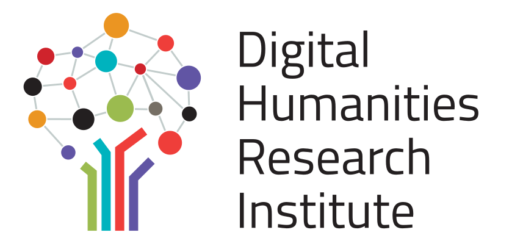

# 2024 Institute at Bryn Mawr College

**Tuesday, May 7, 2024, Benham Gateway Conference Center**

Now in its 4th iteration, the TriCo Digital Scholarship Research Institute is an intensive, cohort-based learning program developed and taught by the TriCo Libraries Digital Scholarship Group. Through instensive workshops, discussions, and project showcases, participants gain experience with fundamental digital scholarship tools and methods but also explore project support and grant opportunities in the Trico and beyond, crafting potential projects and digital assignments, and wayfinding through the maze of possible tools, services, and platforms for digital research.

## Schedule

| 8:45 - 9:15 am | Introductions, overview, breakfast  |
| 9:15 - 10:30 am | [Web Publishing with GitHub Pages I](https://github.com/tri-cods/github-pages)|
| 10:30 - 10:45 am | Break |
| 10:45 - 12:00 pm | [Web Publishing with GitHub Pages II](https://github.com/tri-cods/github-pages) |
| 12:00 - 1:15 pm | Lunch (at Wyndham Terrace) |
| 1:15 - 2:30 pm | [Designing Digital Scholarship Assignments I](https://docs.google.com/document/d/15z97WMthPk5OMN3SFgOhAT8oh9Pj-JXU2HDMRlEr4i8/edit?usp=sharing) |
| 2:30 - 2:45 pm | Break with refreshments |
| 2:45 - 4:00 pm | [Designing Digital Scholarship Assignments II](https://docs.google.com/document/d/15z97WMthPk5OMN3SFgOhAT8oh9Pj-JXU2HDMRlEr4i8/edit?usp=sharing) |
| 4:00 - 4:30 pm | Lightning Presentations |
| 4:30 - 5:00 pm | Happy Hour (at the Sunken Garden) |

## Workshops

### [Web Publishing with GitHub Pages](https://github.com/tri-cods/github-pages)

*Alice McGrath (BMC) and Roberto Vargas (SC)*

GitHub Pages is a popular, free option for publishing static websites. This workshop will introduce participants to the Github Pages ecosystem – including git, markdown, the GitHub platform, and a bit of html and css – and explore why it may be a good option for a personal website or digital project. We’ll also discuss some of the social and environmental considerations at play when choosing web platforms, and why static sites are faster, more sustainable, and more secure than sites created by content management systems (such as WordPress or Google Sites). Participants will also gain hands-on experience publishing, editing, and customizing a GitHub Pages site.

### [Designing Digital Scholarship Assignments](https://docs.google.com/document/d/15z97WMthPk5OMN3SFgOhAT8oh9Pj-JXU2HDMRlEr4i8/edit?usp=sharing)

*Patty Guardiola (HC), Anna Lacy (HC) and Amanda Licastro (SC)*

What is digital scholarship and what can it do in the classroom? This workshop will demonstrate how to plan and execute student-centered digital scholarship assignments from scaffolding to assessment. We will introduce a suite of easy-to-learn tools that students can use to build interactive and engaging digital projects, while emphasizing the critical evaluation of both the tools and public-facing products (for example, digital exhibits/timelines, interactive maps, and multimodal publications). We will discuss models for planning, providing feedback, and assessing digital scholarship assignments.

### Past institutes

- [2025 Institute at Haverford College](2025)
- [2024 Institute at Bryn Mawr College](2024)
- [2023 Institute at Haverford College](2023)
- [2021 Institute held remotely](2021)
- [2019 Institute at Bryn Mawr College](2019)
  
*The DSRI is sponsored by Bryn Mawr College’s LITS, Haverford College Libraries, and Swarthmore Libraries. The Tri-Co DSRI was developed as part of the NEH-sponsored [Digital Humanities Research Institute](http://dhinstitutes.org/) hosted at the CUNY Grad Center in June 2018.*

{: .logos}
