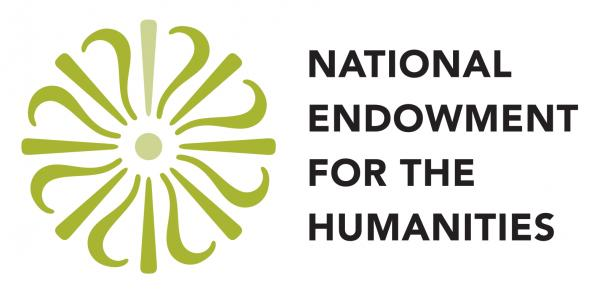

# **Digital Scholarship Research Institute**

The Digital Scholarship Research Institute (DSRI) is a two-day intensive institute for Tri-Co faculty to explore interdisciplinary digital scholarship research and teaching methods through hands-on workshops and guided practices. We welcome both faculty new to digital scholarship and those interested in taking their skills to the next level. You can expect to gain experience with fundamental digital scholarship tools and methods including navigating your computer via the command line, cleaning messy data, practicing version control, and sharing your work publicly, while also learning about local digital scholarship communities and support.

The Digital Scholarship Research Institute will be hosted in room 245 of the newly renovated Park Science Building at Bryn Mawr College from **May 6-7, 2019**. Workshops and events will be held **9:00 A.M. - 5:00 P.M. on May 6th**, and **9:00 A.M. - 6:30 P.M. on May 7th**.  Breakfast, lunch, and snacks will be catered on both days, and a beer and wine reception with hors d'oeuvres will be provided on the second day.

Because an essential aspect of the DSRI is building community among Tri-Co faculty members interested in digital scholarship, participants are expected to commit to attending the full two-day experience at Bryn Mawr College from May 6-7, 2019 and to attend all of the workshops, seminars, and events during this time.  (See childcare options provided or recommended by [Bryn Mawr](https://www.brynmawr.edu/humanresources/daycare-assistance), [Haverford](https://www.haverford.edu/sites/default/files/Office/Provost/HC-Daycare-Recommendations.pdf), and [Swarthmore](https://www.swarthmore.edu/human-resources/child-and-eldercare-resources).)

*The DSRI is sponsored by Bryn Mawr College’s LITS, Haverford College Libraries, and Swarthmore Libraries. The Tri-Co DSRI was developed as part of the NEH-sponsored [Digital Humanities Research Institute](http://dhinstitutes.org/) hosted at the CUNY Grad Center in June 2018.*

{: .logos}

---

## Location

Room 245 
Park Science Center 
Bryn Mawr College 

[Campus Map](images/access_map_2018.pdf)

## Schedule

### **Monday, May 6, 2019**

| 8:45 - 9:00am | Registration & Breakfast |
| 9:00 - 10:00 | Introductions & Overview |
| 10:00 - 10:30 | [Installations & Break](https://github.com/tri-cods/install) |
| 10:30 - 12:00pm | [Introduction to the Command Line, Part I](https://github.com/tri-cods/command-line) |
| 12:00 - 1:30 | Lunch |
| 1:30 - 2:30 | [Introduction to the Command Line, Part II](https://github.com/tri-cods/command-line) |
| 2:30 - 2:45 | Break |
| 2:45 - 4:00 | [GitHub for Scholars, Part I](https://github.com/tri-cods/github) |
| 4:00 - 5:00 | [Wrap-Up](https://docs.google.com/forms/d/e/1FAIpQLSeldzPiCrXjv1gdI1qB-1hQHP945cxQj0ZK83i63cLh5fUT7w/viewform?usp=sf_link) & Happy Hour Installations |
| | |

### **Tuesday, May 7, 2019**

| 8:45 - 9:00am | Breakfast |
| 9:00 - 9:30 | Introductions & Overview |
| 9:30 - 10:45 | [GitHub for Scholars, Part II](https://github.com/tri-cods/github) |
| 10:45 - 11:00 | Break |
| 11:00 - 12:15pm | [Tidy(ish) Data, Part I](https://github.com/tri-cods/tidy-data) |
| 12:15 - 1:30 | Lunch |
| 1:30 - 2:45 | [Tidy(ish) Data, Part 2](https://github.com/tri-cods/tidy-data) |
| 2:45 - 3:00 | Break |
| 3:00 - 4:30 | Project Workshop |
| 4:30 - 5:00 | Wrap-up |
| 5:00 - 6:30 | Reception |
| | |

---

## Workshop Descriptions

### **[Command Line](https://github.com/tri-cods/command-line)**

The command line is a powerful, text-based way to interact with your computer. You can automate tasks such as creating, copying, and converting files, set up your programming environment, run programs, control other computers remotely, and access programs and utilities that do not have graphical equivalents. In this introduction, we will learn common commands to explore and manipulate a simple data set. By the end of the session, we'll be able to navigate your computer, create and manipulate files, and transform text-based data using only the command line. Stepping away from a point-and-click workflow, we move into an environment where we have more minute control over each task we'd like the computer to perform. In addition to being a useful tool in itself, the command line gives us access to a second set of programs and utilities and is a complement to learning programming.

### Why learn the command line?

Beyond being one of the most fundamental and powerful ways to interact with your computer, learning the basics of the command line will make it easier to use a number of digital scholarship methods and tools.

### Further reading: [ProfHacker](https://www.chronicle.com/blogs/profhacker/the-profhacker-guide-to-the-command-line/36125) / [Programming Historian](https://programminghistorian.org/en/lessons/intro-to-bash)

### **[Tidy(ish) Data](https://github.com/tri-cods/command-line)**

In order to begin thinking about digital methods, scholars must first make the conceptual leap toward thinking about their research as data. How do we get at the data in our research and how do we make it useful and usable by machines? What are some of the promises (and perils) of reframing research as data? By the end of the session, we’ll be introduced to strategies and tools for taking very different kinds of information and creating well-formed data, data that can then be used for analysis or visualization.

### Why learn to keep your data clean and tidy?

### Further reading: [Programming Historian](https://programminghistorian.org/en/lessons/cleaning-data-with-openrefine#why-should-historians-care-about-data-quality)

### **[Intro to git/GitHub](https://github.com/tri-cods/github)**

Git is a tool for managing changes to a set of files. It allows users to recover earlier versions of a project, and collaborate with other contributors. GitHub is a web-based platform that provides access to open source repositories and facilitates collaboration on files, code, or datasets. This session will introduce participants to version control and collaboration using Git and GitHub, and demonstrate their use in digital projects.

### Why learn git/GitHub?

If you’ve ever wanted a clean way to keep an organized history of your documents, data, or code without saving dozens of numbered copies of the same files, git and Github can help while also facilitating collaborative research and authoring.

### Further reading: [PhDComics](http://phdcomics.com/comics/archive_print.php?comicid=1531) / [Version Control and Academic Writing](https://www.colinmclear.net/posts/versioncontrol/)

---

## Course Instructors





<strong>{{ contributor[1].name }}</strong>
{{ contributor[1].bio }}



